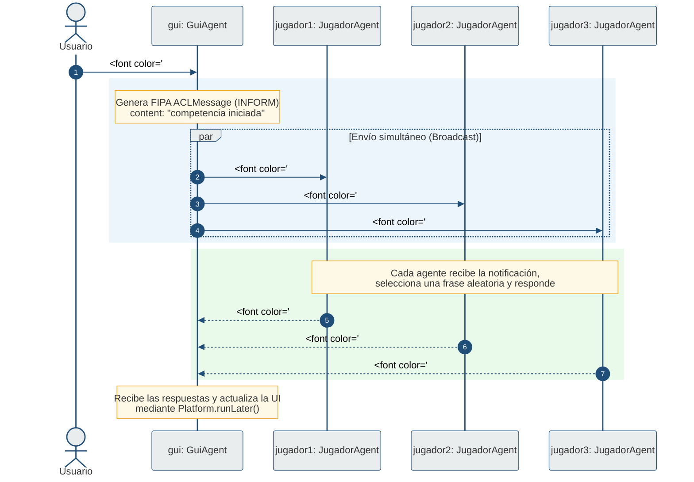

```mermaid
%%{init: { 'theme': 'base', 'themeVariables': { 'signalColor': '#1f4e78', 'signalTextColor': '#000000', 'actorBkg': '#eaeded', 'actorBorder': '#1f4e78', 'noteBkgColor': '#fef9e7', 'noteBorderColor': '#f39c12' } }}%%
sequenceDiagram
    autonumber
    actor Usuario
    participant GUI as gui: GuiAgent
    participant J1 as jugador1: JugadorAgent
    participant J2 as jugador2: JugadorAgent
    participant J3 as jugador3: JugadorAgent

    Usuario->>GUI: <font color="#b03a2e"><b>Clic en "Iniciar Competencia"</b></font>
    
    rect rgb(235, 245, 251)
        note over GUI: Genera FIPA ACLMessage (INFORM)<br/>content: "competencia iniciada"
        par Envío simultáneo (Broadcast)
            GUI->>J1: <font color="#1b4f72"><b>ACLMessage (INFORM)</b></font>
            GUI->>J2: <font color="#1b4f72"><b>ACLMessage (INFORM)</b></font>
            GUI->>J3: <font color="#1b4f72"><b>ACLMessage (INFORM)</b></font>
        end
    end

    rect rgb(234, 250, 234)
        note over J1,J3: Cada agente recibe la notificación,<br/>selecciona una frase aleatoria y responde
        J1-->>GUI: <font color="#117a65"><b>ACLMessage (INFORM) ["Frase aleatoria J1"]</b></font>
        J2-->>GUI: <font color="#117a65"><b>ACLMessage (INFORM) ["Frase aleatoria J2"]</b></font>
        J3-->>GUI: <font color="#117a65"><b>ACLMessage (INFORM) ["Frase aleatoria J3"]</b></font>
    end

    note over GUI: Recibe las respuestas y actualiza la UI<br/>mediante Platform.runLater()
```